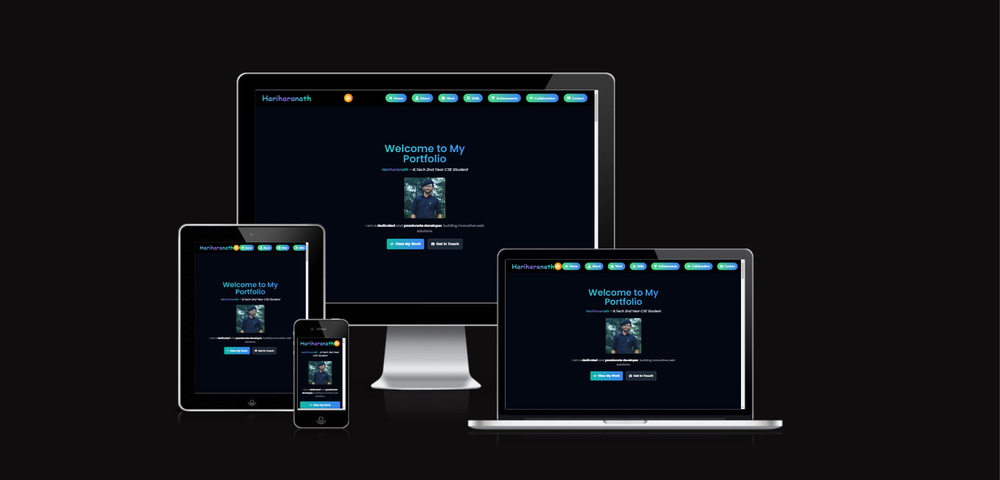

# Hariharanath's Portfolio


Welcome to the official portfolio of Hariharanath! This website showcases my work, achievements, and provides quick access to my contact and social links. Feel free to explore and connect with me!

## Table of Contents
- [About Me](#about-me)
- [Work](#work)
- [Achievements](#achievements)
- [Collaboration](#collaboration)
- [Contact](#contact)
- [Social Links](#social-links)

## About Me
I am a passionate developer focused on building innovative solutions using modern technologies. My goal is to bring ideas to life, one line of code at a time.

I specialize in web development, focusing on creating dynamic and responsive websites that provide seamless user experiences.

## Work
Check out my work below:
- **Projects**: Discover the various projects I have worked on, including web apps, websites, and other technical solutions.
- **Tech Stack**: I work with a wide range of technologies such as React, JavaScript, and more.

## Achievements
- Successfully built and deployed multiple web applications.
- Contributed to open-source projects and collaborated with developers around the world.
- Received recognition for outstanding development skills in various technical communities.

## Collaboration
I am always open to collaboration! Whether you're a developer, designer, or business, feel free to reach out to discuss potential projects, ideas, or opportunities.

## Contact
You can reach me through any of the following:
- **Email**: [hariharanath247@gmail.com](mailto:hariharanath247@gmail.com)
- **LinkedIn**: [hariharanath's LinkedIn](https://www.linkedin.com/in/hari-hara-nath-a13583282/)
- **Twitter**: [@Hariharana70309](https://x.com/Hariharana70309?t=Ib05QY4zN8F41MsLHAix5Q&s=09)
- **GitHub**: [Hari-hara7 GitHub](https://github.com/Hari-hara7)
- **Instagram**: [hari_hara_nath77 Instagram](https://instagram.com/hari_hara_nath77)
- **Medium**: [hariharanath247 Medium](https://medium.com/@hariharanath247)
- **Discord**: [Join My Discord Server](https://discord.gg/Xn8uyh4Js)

## Social Links
You can also follow me on the following platforms for updates:
- **Twitter**: [@Hariharana70309](https://x.com/Hariharana70309?t=Ib05QY4zN8F41MsLHAix5Q&s=09)
- **LinkedIn**: [Hariharanath's LinkedIn](https://www.linkedin.com/in/hari-hara-nath-a13583282/)
- **GitHub**: [Hari-hara7 on GitHub](https://github.com/Hari-hara7)
- **Instagram**: [@hari_hara_nath77 on Instagram](https://instagram.com/hari_hara_nath77)
- **Medium**: [@hariharanath247 on Medium](https://medium.com/@hariharanath247)
- **Discord**: [Join My Discord Server](https://discord.gg/Xn8uyh4Js)

## Technologies Used
- **Frontend**: React, Tailwind CSS
- **Backend**: Node.js, Express
- **Version Control**: Git, GitHub
- **Other Tools**: React Router, React Icons, Firebase (if applicable)

## How to Run Locally
To run this project locally, follow these steps:

1. **Clone the repository**:
   ```bash
   git clone https://github.com/Hari-hara7/portfolio.git
