<div align="center">

# 🚀 Hariharanath's Portfolio Universe


[](https://github.com/Hari-hara7)
[](https://github.com/Hari-hara7)

</div>

---

## 🎯 Portfolio Preview

<div align="center">
<table>
<tr>
<td width="50%">

### 🖥️ All Screens Experience


</td>
<td width="50%">

### 📱 Architecture


</td>
</tr>
</table>

### 🔗 **Live Portfolio**: [Visit Now](https://hari-portfolio-3759b.web.app) | 🛠️ **Tech Demo**: [GraphQL API](https://portfolio-site-1-ny0v.onrender.com/graphql)

</div>

---

## 🌟 About Me


```typescript
const hariharanath = {
    role: "Full-Stack Developer",
    location: "India 🇮🇳",
    languages: ["TypeScript", "JavaScript", "c++"],
    architecture: [ "Event-Driven", "Serverless"],
    techStack: {
        frontend: ["React", "TypeScript", "Tailwind CSS", "Framer Motion"],
        backend: ["Node.js", "GraphQL", "Express", "Apollo Server"],
        database: ["PostgreSQL", "Firebase", "Prisma ORM"],
        cloud: ["Vercel", "Firebase", "Render", "Neon DB"],
        tools: ["Vite", "Git", "Docker", "Prisma"]
    },
    currentFocus: "Building scalable web applications with modern tech",
    funFact: "I love creating interactive 3D experiences with Three.js!"
};
```

### 🎨 What I Do
- 🔥 **Frontend Excellence**: Crafting pixel-perfect, responsive UIs with React & TypeScript
- ⚡ **Backend Architecture**: Building scalable APIs with GraphQL and Node.js
- 🎭 **UI/UX Design**: Creating seamless user experiences with modern design principles
- 🌐 **Full-Stack Solutions**: End-to-end development from concept to deployment

---

## 🏗️ Architecture & Skills Overview

```mermaid
graph TB
    A[🎯 Frontend Layer] --> B[⚡ Backend Services]
    B --> C[💾 Database Layer]
    
    A --> A1[React + TypeScript]
    A --> A2[Tailwind CSS + Framer Motion]
    A --> A3[Three.js + GSAP]
    
    B --> B1[Node.js + Express]
    B --> B2[GraphQL + Apollo]
    B --> B3[RESTful APIs]
    
    C --> C1[PostgreSQL + Prisma]
    C --> C2[Firebase Firestore]
    C --> C3[Neon DB Cloud]
    
    D[☁️ Cloud & Deployment] --> D1[Vercel]
    D[☁️ Cloud & Deployment] --> D2[Firebase Hosting]
    D[☁️ Cloud & Deployment] --> D3[Render.com]
    
    style A fill:#61dafb
    style B fill:#68d391
    style C fill:#f093fb
    style D fill:#fbb040
```



---


## 🚀 Featured Projects

<div align="center">

### 🎨 Interactive Portfolio Website
[](https://hari-portfolio-3759b.web.app)
[](https://github.com/Hari-hara7/Portfolio-site)

<table>
<tr>
<td width="33%">

**🎯 Key Features:**
- ⚡ Lightning-fast React + Vite
- 🎨 Smooth Framer Motion animations  
- 📱 Fully responsive design
- 🌐 GraphQL API integration

</td>
<td width="33%">

**🛠️ Tech Stack:**
- React + TypeScript
- Tailwind CSS + Framer Motion
- Firebase + Firestore
- Node.js + GraphQL

</td>
<td width="33%">

**✨ Highlights:**
- Interactive 3D elements
- Real-time guestbook
- Blog system with CMS
- Professional showcase

</td>
</tr>
</table>

### 🖥️ GraphQL Backend Server
[](https://portfolio-site-1-ny0v.onrender.com/graphql)
[](https://github.com/Hari-hara7/Portfolio-site/tree/main/server)

<table>
<tr>
<td width="50%">

**🔧 Backend Features:**
- 🚀 Apollo GraphQL Server
- 🗄️ Prisma ORM + PostgreSQL
- 🔒 Real-time data operations
- ☁️ Cloud deployment ready

</td>
<td width="50%">

**📊 Performance:**
- ⚡ Sub-100ms response times
- 🔄 Real-time subscriptions
- 📈 Scalable architecture
- 🛡️ Type-safe operations

</td>
</tr>
</table>

</div>

---

## 🛠️ Technology Arsenal

<div align="center">

### 🎨 Frontend Technologies


### ⚙️ Backend & Database


### ☁️ Cloud & Deployment


</div>


---

## 📈 GitHub Statistics & Analytics

<div align="center">

<table>
<tr>
<td width="50%">


</td>
<td width="50%">


</td>
</tr>
</table>

### 🔥 Contribution Activity


### 🏆 GitHub Achievements


</div>

---

## 🌟 Experience & Collaborations

<div align="center">

### 🤝 Professional Partnerships

<table>
<tr>
<td align="center" width="25%">

[](https://is-cod.in)
**Domain Services Partnership**
Strategic collaboration & insights

</td>
<td align="center" width="25%">

[](https://finiteloop.io)
**Tech Innovation**
Coding projects & mentorship

</td>
<td align="center" width="25%">

[](https://github.com/Hari-hara7)
**Tech Startup**
Innovative solutions & scaling

</td>
<td align="center" width="25%">

[](https://www.acm.org)
**Professional Development**
Algorithm & programming excellence

</td>
</tr>
</table>


</div>

---

## 🏆 Achievements & Recognition

<div align="center">

### 🎖️ Professional Milestones

[](#)
[](#)
[](#)


### 🌟 Key Accomplishments
- ✅ **Full-Stack Expertise**: Successfully built and deployed multiple production-ready applications
- ✅ **Technical Leadership**: Co-founded tech startup with focus on innovative solutions  
- ✅ **Community Impact**: Active contributor to open-source projects and developer communities
- ✅ **Professional Recognition**: Received offers from leading tech organizations
- ✅ **Modern Tech Mastery**: Specialized in cutting-edge technologies and frameworks

</div>

---

## 🤝 Open Source & Collaboration

<div align="center">

### 🔄 Contribution Philosophy

> *"Code is not just about solving problems—it's about building bridges between ideas and creating solutions that empower others."*

[](https://github.com/Hari-hara7)
[](mailto:hariharanath247@gmail.com)

### 🌍 Looking to Collaborate On:
- 🚀 **Innovative Web Applications** - Modern React/TypeScript projects
- 🛠️ **Open Source Tools** - Developer productivity and utility projects  
- 🎨 **UI/UX Libraries** - Reusable component libraries and design systems
- 📱 **Full-Stack Platforms** - End-to-end application development
- 🔗 **API Development** - GraphQL and RESTful service architecture

</div>

---

## 📞 Connect & Collaborate

<div align="center">

### 🌐 Let's Build Something Amazing Together!

<table>
<tr>
<td align="center" width="20%">

[](mailto:hariharanath247@gmail.com)

</td>
<td align="center" width="20%">

[](https://www.linkedin.com/in/hari-hara-nath-a13583282/)

</td>
<td align="center" width="20%">

[](https://x.com/Hariharana70309)

</td>
<td align="center" width="20%">

[](https://github.com/Hari-hara7)

</td>
<td align="center" width="20%">

[](https://hari-portfolio-3759b.web.app)

</td>
</tr>
</table>

### 📱 Additional Platforms

[](https://instagram.com/hari_hara_nath77)
[](https://medium.com/@hariharanath247)
[](https://discord.gg/Xn8uyh4Js)

### 💬 Response Time
- 📧 **Email**: Within 24 hours
- 💼 **LinkedIn**: Within 12 hours  
- 🐦 **Social Media**: Within 6 hours

</div>

---

## 🚀 Quick Start Guide

Want to explore my portfolio locally? Here's how:

```bash
# Clone the repository
git clone https://github.com/Hari-hara7/Portfolio-site.git

# Navigate to the project
cd Portfolio-site/Hari

# Install dependencies
npm install

# Start development server
npm run dev

# Build for production
npm run build
```

### 🛠️ Tech Requirements
- **Node.js** 18+ 
- **npm** or **yarn**
- **Modern Browser** (Chrome, Firefox, Safari)

---

<div align="center">

### 🌟 Thank You for Visiting!


[](https://github.com/Hari-hara7)
[](https://reactjs.org)
[](https://www.typescriptlang.org)

⭐ **Star this repo if you found it helpful!** ⭐

</div>

---

<div align="center">
<sub>© 2024 Hariharanath. All rights reserved. Built with passion and modern web technologies.</sub>
</div>
